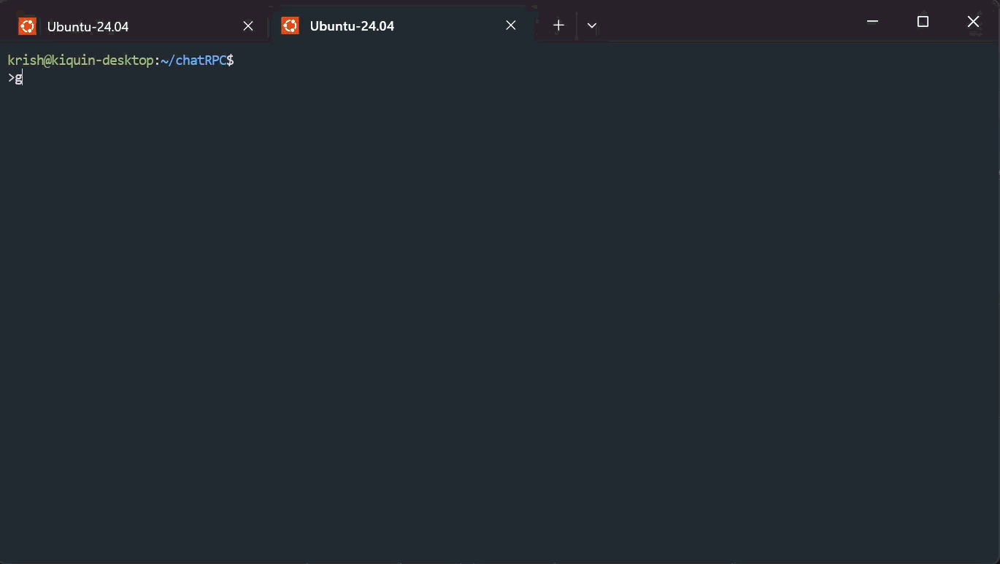
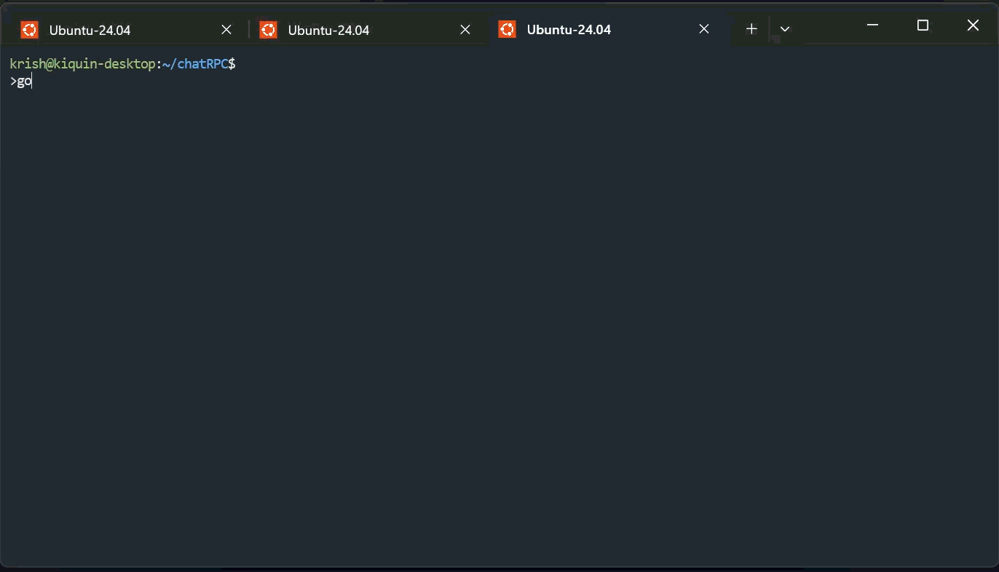
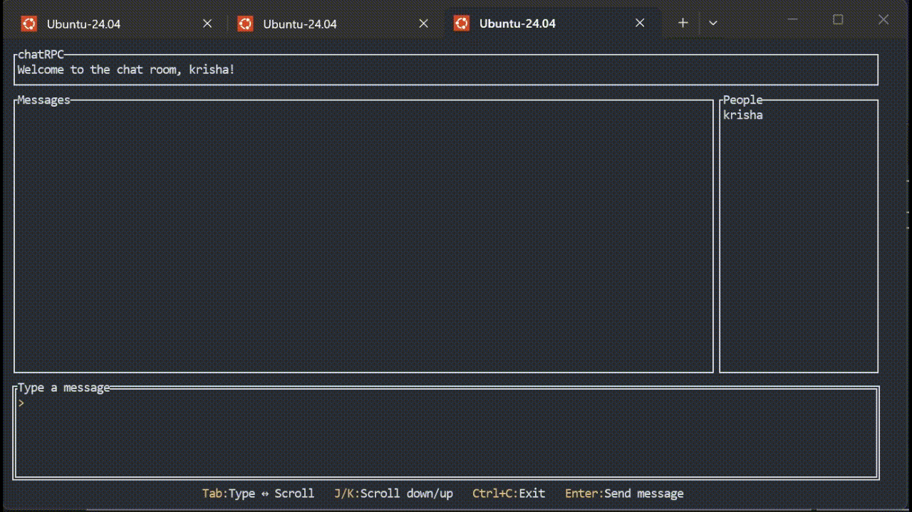

<!-- # chatRPC
A self-directed project to build a distributed chat service from scratch in Go. Currently, it implements node discovery, allowing nodes to find and connect to each other. Future work includes adding messaging and group communication. Inspired by my university distributed systems course, but reimplemented independently to strengthen my understanding of networking, concurrency, and distributed coordination. -->

# ChatRPC
A decentralized messaging system built in Go, featuring a custom-designed networking protocol and node management system. This project was built to explore low-level networking concepts, packet serialization, and peer-to-peer communication without relying on high-level PRC libraries.

## How to install
1. Run the following command:  
`git clone git@github.com:krishaiquin/chatRPC.git`

## How to Use
1. Run the following command:  
`go run cmd/nodesetd/nodeset.go`  
This will return the address of the server which will be needed for running the chat system. Copy it to feed it to the command for running the chat system

2. Once the address of Nodeset server has been obtained, paste it as an argument for following command:  
`go run cmd/chat/chat.go <Nodeset Server Address>`

## Demo

## 🚀 Features
- **Hybrid Architecture**
    - Centralized Node Discovery: A dedicated registry server called Nodeset handles node registration/de-registration.
    - Decentralized Messaging: Peer-to-peer chat delivery, once nodes are discovered, they communicate directly with one another.
- **UDP-Based Communication**: Optimized for low-latency, utilizing raw UDP sockets for all cluster interactions.
- **Custom Packet Schematic**: Implemented a ground-up packet design to deconstruct the "magic" of standard RPC.

## 🛠️ How it works

- Node Registration
    - When a node starts up, it sends a request to Nodeset server to add it to the cluster. The Nodeset server, then, sends a request to each node in the cluster to add the new node to their local copy of the cluster. The Nodeset sends a reply to the new node with their node ID and the full list of cluster.

- Node Deregistration
    - When a node exists the chat (via ctrl + c), the exiting node sends a request to the Nodeset server to remove it from the cluster. The Nodeset server, then, sends a request to each node in the cluster to remove the exiting node from their copy of the cluster.

- Peer-to-Peer Messaging
    - Once a node knows the IP and Port of its peers, messages are sent directly to those addresses. This ensures that the chat traffic doesn't bottleneck at a single server.

- The Packet Schematic
    - Because this uses UDP, the system currently follow a "best effort" delivery model.

**Packet structure:**  

| Field |  Size (bytes)  | Description |
|:-----:|:--------:|:--------------:|
| SeqNum   | 32 | Sequence Number |
| PacketType   |  1  | Request or Response|
| Payload | Variable | Data of the packet |

## What's next?

- **Enhanced Reliability**
    - Retry Mechanism: Add a retry mechanism that attempts to re-sent lost packets up to 4 times with increasing delays to avoid network congestion
    - Heartbeats: Implement periodic "heartbeat" packet from nodes to Nodeset server to detect silent departures (crashes) more accurately

- **Scaling**
    - Decentralized Node Discovery Protocol: Decentralized Node discovery by using Gossip Protocol to remove single point of failure

 

Go to [PROGRESS.md](PROGRESS.md) to view progress on the project.